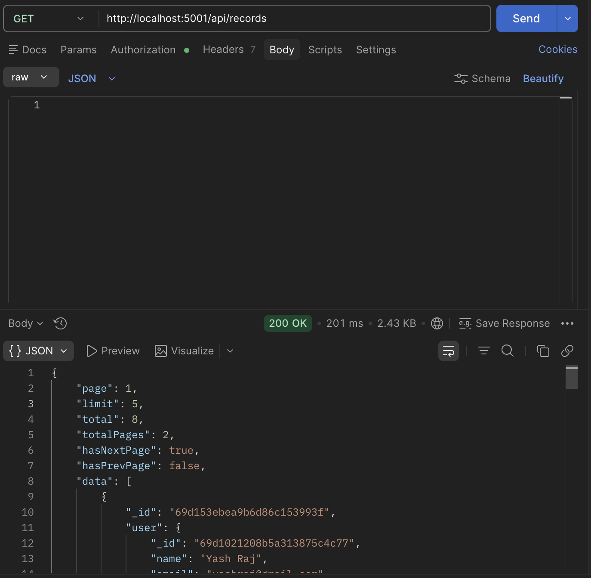
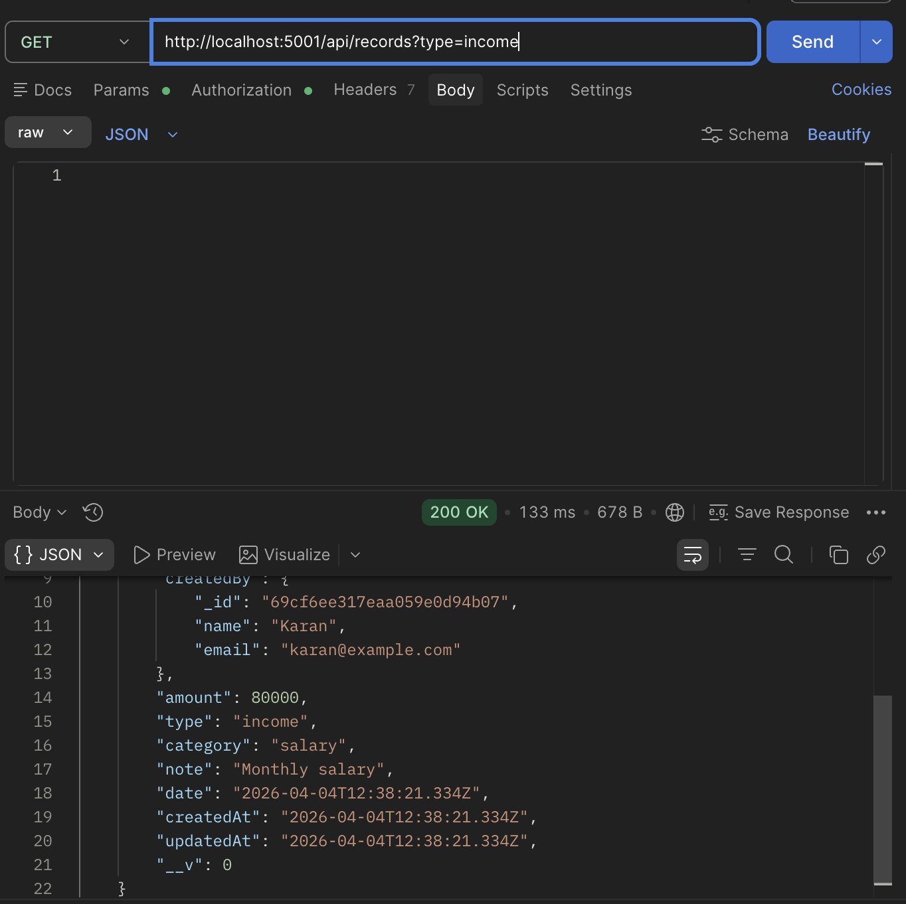
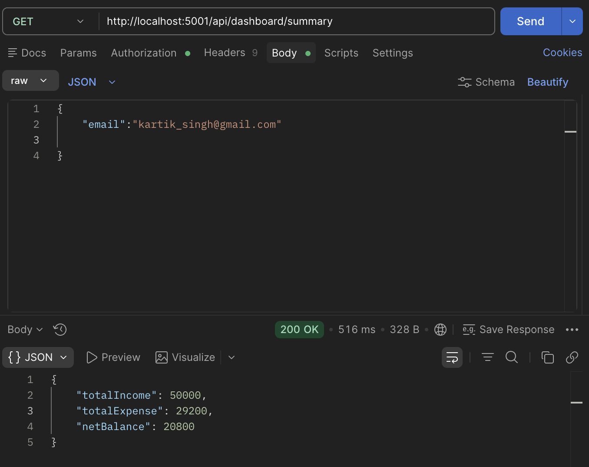
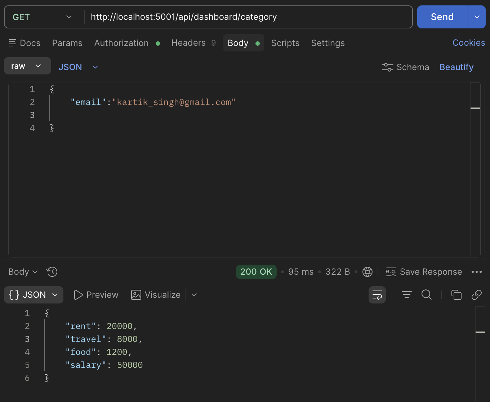

#  Finance Dashboard Backend
> Submitted for Zorvyn Backend Developer Intern Assignment - April 2026
##  Overview

This project is a backend system for a **Finance Dashboard** that manages financial records with **role-based access control** and provides **summary analytics**.

It is designed to demonstrate backend fundamentals such as:

* API design
* Data modeling
* Access control
* Aggregation logic
* Clean architecture

---

##  Roles & Permissions

The system supports three roles:

###  Viewer

* Can view **only their own records**
* Can access **their own summary, category-wise, and monthly data**

---

###  Analyst

* Can view **all records**
* Can access **global summary, category-wise, and monthly analytics**
* Cannot modify data

---

###  Admin

* Full access:

  * Create records
  * Update records
  * Delete records
* Can view **all records and analytics**

---

## Tech Stack

* **Node.js**
* **Express.js**
* **MongoDB + Mongoose**
* **JWT Authentication**
* **bcrypt (password hashing)**

---

##  Data Models

### User

```json
{
  "name": "string",
  "email": "string",
  "password": "string",
  "role": "viewer | analyst | admin",
  "isActive": "boolean"
}
```

---

### Record

```json
{
  "user": "ObjectId (owner of record)",
  "createdBy": "ObjectId (admin who created it)",
  "amount": "number",
  "type": "income | expense",
  "category": "string",
  "date": "Date",
  "note": "string"
}
```

---

##  Authentication

Uses **JWT-based authentication**

### Register

```http
POST /api/auth/register
```


### Login

```http
POST /api/auth/login
```

Returns:

```json
{
  "token": "...",
  "user": { ... }
}
```


---

##  API Endpoints

###  Records

#### Create Record (Admin only)

```http
POST /api/records
Authorization: Bearer TOKEN
```

---

#### Get Records


```http
GET /api/records
```

Supports pagination, search, and filtering via query parameters.
<p align="center">
  
</p>

* Viewer → only own records
* Analyst/Admin → all records

Supports filters:

* `type`
 <p align="center">
  
</p>

* `category`
* `type + category`

Supports:
* `Pagination`
  * `page` (default: 1)
  * `limit` (max: 50)

Returns:

```json
{
  "page": 1,
  "limit": 5,
  "total": 22,
  "totalPages": 4,
  "hasNextPage": true,
  "hasPrevPage": false,
  "data": [ ...records ]
}
```

* Search:
  * `search` : Searches in type and category
 
    * `Search` : /api/records?search=food
    * `Search + Pagination` : /api/records?search=salary&page=1&limit=5
    * `Search + Filters` : /api/records?search=food&type=expense
---

#### Update Record (Admin only)

```http
PATCH /api/records/:id
```

---

#### Delete Record (Admin only)

```http
DELETE /api/records/:id
```

---


### Managing Users (Admin only)

#### Get All Users

```http
GET /api/users
```
Authorization: Bearer TOKEN

Update User Role

```http
PATCH /api/users/:id/role
```

```json
{
  "role": "analyst"
}
```

Toggle User Status

```http
PATCH /api/users/:id/status
```
Delete User (Soft Delete)

```http
DELETE /api/users/:id
```

- Sets isActive = false  
- User is not permanently removed

---

##  Dashboard APIs

### Summary

```http
GET /api/dashboard/summary
```

<p align="center">
  
</p>


Returns:

```json
{
  "totalIncome": 50000,
  "totalExpense": 29200,
  "netBalance": 20800
}
```

---

### Category-wise

```http
GET /api/dashboard/category
```
<p align="center">
  
</p>


Example:

```json
{
  "rent":20000,
  "travel":8000,
  "food": 1200,
  "salary": 50000
}
```

---
### Recent Activity
```http
GET /api/records?limit=5&sort=-date
```
Returns 5 most recent transactions for the user.

### Monthly Trends

```http
GET /api/dashboard/monthly
```

Example:

```json
{
  "2026-04": 5000
}
```

---

##  Access Control Logic

* Implemented using middleware:

  * `verifyToken`
  * `allowRoles`

* Role-based filtering ensures:

  * Data privacy for viewers
  * Full visibility for analysts/admins
  * Restricted modifications

---

##  Key Design Decisions

* **Separation of concerns** (routes, controllers, models, middleware)
* **Role-based data filtering** instead of multiple APIs
* **Records linked to users** for ownership
* **Admin-controlled data creation**
* Designed with scalability and real-world use cases in mind
* Schema-level validation using Mongoose to ensure data integrity and prevent invalid inputs

---
## Additional Features

* Pagination to handle large datasets efficiently  
* Search support for quick record lookup  
* Query-based filtering (type, category)  
* Rate limiting to prevent API abuse, with stricter limits on authentication routes
* Soft delete implementation for users using an `isActive` flag (no permanent data loss)

##  Performance Optimization

Added a compound index:

```js
recordSchema.index({ user: 1, date: -1 });
```

This improves performance for:

* User-specific queries
* Sorting records by date

---

##  Testing

* All APIs tested using **Postman**
* Verified:

  * Role-based access control
  * Data filtering
  * Dashboard calculations
  * CRUD operations

---

##  Project Structure

```
/models
/controllers
/routes
/middleware
```

---

## Setup Instructions

```bash
git clone https://github.com/Karan-codes1/Finance-Dashboard-Backend.git
cd Finance-Dashboard-Backend
npm install
```

Create `.env` file:

```
MONGO_URI=your_mongo_url
JWT_SECRET=your_secret
```

Run server:

```bash
npm start
```

---

## Assumptions Made
- Records are always created by admins (viewers/analysts can't create)
- Date format follows ISO 8601
- Categories are free-text (not predefined list)
- Monthly trends show net balance, not separate income/expense

---

##  Conclusion

* This project demonstrates a backend system with role-based access control, schema validation, pagination, filtering, rate limiting, and soft deletion.
* It is designed to reflect a realistic production-style API with clean structure and scalable patterns.

---
